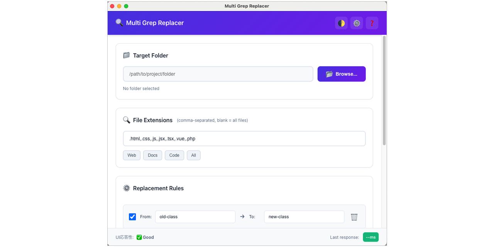

# Multi Grep Replacer User Guide

## Table of Contents

1. [Introduction](#introduction)
2. [Installation](#installation)
3. [Getting Started](#getting-started)
4. [Basic Operations](#basic-operations)
5. [Advanced Features](#advanced-features)
6. [Troubleshooting](#troubleshooting)
7. [FAQ](#faq)

## Introduction

Multi Grep Replacer is a powerful desktop application that allows you to perform multiple find-and-replace operations across multiple files simultaneously. Built with Electron, it provides a modern, responsive interface that works seamlessly on both Mac and Windows.

### Key Features

- 🚀 **Multiple Replacement Rules**: Define multiple find-and-replace patterns that execute sequentially
- 📁 **Recursive File Search**: Process files in subdirectories automatically
- 🎯 **File Extension Filtering**: Target specific file types
- 💾 **Configuration Management**: Save and load replacement configurations
- 🌙 **Dark Mode Support**: Automatic theme switching based on system preferences
- ⚡ **High Performance**: Process 1000+ files in under 30 seconds
- 🛡️ **Safe Operations**: Preview changes before execution

## Installation

### macOS

1. Download the latest `MultiGrepReplacer-x.x.x.dmg` from the [Releases page](https://github.com/sarap422/multi-grep-replacer/releases)
2. Double-click the downloaded `.dmg` file
3. Drag the `Multi Grep Replacer` app to your Applications folder
4. First launch: Right-click the app and select "Open" to bypass Gatekeeper

### Windows

1. Download the latest `MultiGrepReplacer-Setup-x.x.x.exe` from the [Releases page](https://github.com/sarap422/multi-grep-replacer/releases)
2. Run the installer
3. Follow the installation wizard
4. Launch from Start Menu or Desktop shortcut

### Linux

1. Download the appropriate package for your distribution:
   - `.deb` for Debian/Ubuntu
   - `.rpm` for Fedora/RHEL
   - `.AppImage` for universal Linux
2. Install using your package manager or run the AppImage directly

## Getting Started

### First Launch

When you first launch Multi Grep Replacer, you'll see the main window with these key sections:



1. **Target Folder**: Where you'll select the directory to process
2. **File Extensions**: Filter which file types to include
3. **Replacement Rules**: Define your find-and-replace patterns
4. **Action Buttons**: Load/Save configurations and execute replacements

### Your First Replacement

Let's walk through a simple example - updating CSS class names:

1. **Select Target Folder**
   - Click the "Browse..." button
   - Navigate to your project folder
   - Click "Select Folder"

2. **Set File Extensions**
   - Enter `.css,.html` in the extensions field
   - Leave blank to process all text files

3. **Add Replacement Rule**
   - Click the "➕ Add new rule" button
   - In the "From" field, enter: `old-class`
   - In the "To" field, enter: `new-class`

4. **Preview and Execute**
   - Check the file count preview at the bottom
   - Click "🚀 Execute Replacement"
   - Review the results in the completion dialog

## Basic Operations

### Managing Replacement Rules

#### Adding Rules
- Click "➕ Add new rule" to create a new replacement pattern
- Each rule has a checkbox to enable/disable it temporarily
- Rules are executed in order from top to bottom

#### Editing Rules
- Simply click in the From/To fields to edit
- Changes are saved automatically as you type

#### Deleting Rules
- Click the "🗑️" button next to any rule to remove it

#### Reordering Rules
- Drag the "↕️" handle to reorder rules
- Order matters - rules are applied sequentially

### File Filtering

#### By Extension
```
.html,.css,.js,.php
```
- Comma-separated list
- Include the dot (.)
- Leave empty for all files

#### Automatic Exclusions
These directories are automatically excluded:
- `node_modules/`
- `.git/`
- `dist/`
- `build/`
- `vendor/`

### Configuration Management

#### Saving Configurations
1. Set up your replacement rules
2. Click "💾 Save Config"
3. Choose a location and name
4. File is saved as JSON for easy editing

#### Loading Configurations
1. Click "💾 Load Config"
2. Select a previously saved `.json` file
3. All rules and settings are restored

#### Configuration Templates
Check the `config/sample-configs/` directory for pre-made templates:
- `web-development.json`: Common web development replacements
- `css-modernization.json`: Update legacy CSS syntax
- `javascript-refactoring.json`: Modern JavaScript patterns

## Advanced Features

### Keyboard Shortcuts

| Shortcut | Action |
|----------|--------|
| `Ctrl/Cmd + S` | Save configuration |
| `Ctrl/Cmd + O` | Load configuration |
| `Ctrl/Cmd + E` | Execute replacement |
| `Ctrl/Cmd + N` | Add new rule |
| `Ctrl/Cmd + ,` | Open preferences |

### Drag and Drop

- **Folder Selection**: Drag a folder onto the window to set it as target
- **Configuration Files**: Drag a `.json` config file to load it

### Performance Optimization

The app automatically optimizes based on your file set:
- **Stream Processing**: For large files (>50MB)
- **Batch Processing**: For many small files
- **Parallel Processing**: Utilizes multiple CPU cores

### Progress Monitoring

During execution, you'll see:
- Real-time progress bar
- Current file being processed
- Running count of changes made
- Elapsed time
- Pause/Stop controls

## Troubleshooting

### Common Issues

#### "Permission Denied" Errors
**Problem**: Can't modify certain files
**Solution**: 
- Check file permissions
- Run as administrator (Windows)
- Ensure files aren't locked by other applications

#### No Files Found
**Problem**: Preview shows 0 files
**Solution**:
- Verify the folder path is correct
- Check file extension filter
- Ensure files aren't in excluded directories

#### Application Won't Start
**Problem**: App crashes on launch
**Solution**:
- Delete preferences: `~/Library/Application Support/MultiGrepReplacer` (Mac)
- Delete preferences: `%APPDATA%/MultiGrepReplacer` (Windows)
- Reinstall the application

#### Slow Performance
**Problem**: Processing takes too long
**Solution**:
- Close other applications to free memory
- Process folders in smaller batches
- Check for extremely large files

### Error Messages

#### "Invalid replacement rule"
- Ensure both From and To fields have content
- Check for invalid characters

#### "File encoding not supported"
- The app expects UTF-8 encoded files
- Convert files to UTF-8 before processing

#### "Memory limit exceeded"
- Processing too many large files
- Reduce batch size or close other applications

## FAQ

### General Questions

**Q: Can I use regular expressions?**
A: Not in version 1.0. This feature is planned for a future release.

**Q: Is there an undo function?**
A: No automatic undo. We recommend using version control (Git) or creating backups.

**Q: What file types are supported?**
A: Any text-based file (HTML, CSS, JS, PHP, TXT, MD, JSON, XML, etc.)

**Q: Is there a file size limit?**
A: Files over 100MB may cause performance issues.

### Platform-Specific

**Q: Why does macOS say the app is from an unidentified developer?**
A: Right-click the app and select "Open" for first launch. We're working on code signing.

**Q: Can I use it from the command line?**
A: Not currently, but CLI support is on the roadmap.

**Q: Does it work on Apple Silicon Macs?**
A: Yes, we provide universal binaries that run natively on both Intel and Apple Silicon.

### Data and Privacy

**Q: Is my data sent anywhere?**
A: No. All processing happens locally on your machine.

**Q: Are files backed up automatically?**
A: No. Please use version control or create manual backups.

**Q: Where are preferences stored?**
- Mac: `~/Library/Application Support/MultiGrepReplacer`
- Windows: `%APPDATA%/MultiGrepReplacer`
- Linux: `~/.config/MultiGrepReplacer`

## Getting Help

### Support Channels

1. **GitHub Issues**: [Report bugs or request features](https://github.com/sarap422/multi-grep-replacer/issues)
2. **Documentation**: Check this guide and the [developer docs](developer-guide.md)
3. **Community**: Join discussions in the GitHub Discussions tab

### Before Reporting an Issue

1. Check the FAQ and Troubleshooting sections
2. Verify you're using the latest version
3. Try to reproduce the issue
4. Collect relevant information:
   - OS version
   - App version
   - Error messages
   - Steps to reproduce

---

*Last updated: 2025-08-18 | Version 1.0.0*